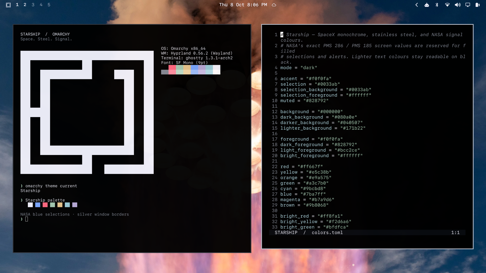

# Starship for Omarchy

Deep black surfaces, SpaceX white, stainless steel borders, and a little NASA. An Omarchy 4 theme with 16 SpaceX photographs, including **Orbital coast** as the default wallpaper.



## Install

```bash
omarchy theme install https://github.com/cube-one-ber/omarchy-starship-theme
```

The theme appears as **Starship** in Omarchy's theme picker. Select it through **Style → Theme**, or apply it with `omarchy theme set starship`.

Cycle the included wallpapers with:

```bash
omarchy theme bg next
```

## Palette

The terminal and editor colours come from **Aether 4.32.0**, using its read-only image palette extractor on all 16 supplied photos:

```bash
aether --extract-palette backgrounds/06-raptor-array.webp --json
```

[`palette.json`](palette.json) preserves all extraction results and maps each selected token to its photo and ANSI palette slot. Aether derives readable colours from image analysis; it can adjust tones, so these are generated image palettes rather than unchanged pixel samples. The muted steel colour uses Aether's `--lighten` utility on the Raptor array's extracted grey.

| Colour | Hex | Source / role |
| --- | --- | --- |
| Space black | `#000000` | SpaceX base backgrounds |
| SpaceX white | `#F0F0FA` | Foreground and primary accent |
| Stainless steel | `#CBD0DB` | Orbital coast; borders and secondary text |
| Plume red | `#E5998D` | Raptor array; terminal and editor errors |
| Exhaust gold | `#E6B88B` | Raptor array; strings and terminal yellow |
| Dawn green | `#84B490` | Starbase dawn; terminal green |
| Orbital cyan | `#91E0FF` | Orbital coast; terminal cyan |
| Engine blue | `#86A1DF` | Raptor array; terminal blue |
| Engine violet | `#C094DE` | Engine bay; terminal magenta |
| NASA blue / PMS 286 | `#0033AB` | Selection background; image-derived bright foreground |
| NASA red / PMS 185 | `#E60D2E` | Bar attention states |

Black and `#F0F0FA` follow [SpaceX's website](https://www.spacex.com/) and its [published stylesheet](https://www.spacex.com/styles.1a4bd8588c6ea618.css). NASA's Pantone designations and these screen hex values are specified in its [Artemis Generation Spacesuits guide, p. 35](https://www.nasa.gov/wp-content/uploads/2023/03/artemis-generation-spacesuits-508.pdf). These small brand accents are retained alongside the image-derived palette.

All normal ANSI text colours and muted text exceed 4.5:1 contrast on black. The image-derived bright foreground on the NASA blue selection exceeds 9:1.

## Omarchy support

Uses Omarchy's semantic `colors.toml` format and its built-in app templates, like the stock themes. Omarchy generates the terminal, Hyprland, Neovim, Helix, btop, browser, and other supported app colours from the palette. `shell.bar.toml` sets a solid black bar with NASA red alerts, and `icons.theme` selects Yaru blue icons. Neovim uses Omarchy's built-in Aether integration.

Requires **Omarchy 4.0 or later**, including support for `shell.*.toml` section overrides. The repository contains the palette and colour-only overrides; terminal configs and Lua files are generated by Omarchy on installation.

`preview.png` is a 1920 × 1080 screenshot of a real Omarchy session showing Ghostty, Omarchy's standard fastfetch logo, and Neovim with this theme.

## Photography

Photography © SpaceX, supplied from SpaceX's X posts. All 16 photographs retain their original dimensions, including the portrait photograph, and are encoded as sRGB WebP to reduce download size. Omarchy fits the selected photograph to the display. No generative imagery or colour filters were added.

[`wallpapers.json`](wallpapers.json) records each original filename, supplied URL, dimensions, and checksums of both the original and distributed image. The default wallpaper is `01-orbital-coast.webp`; filenames set the cycling order.

Theme configuration and the custom icon are MIT licensed. The SpaceX photographs retain their original rights and are excluded from that licence. See [SpaceX's media policy](https://www.spacex.com/trademark) and [photography credits](NOTICE.md). This is an independent, non-commercial community theme.
